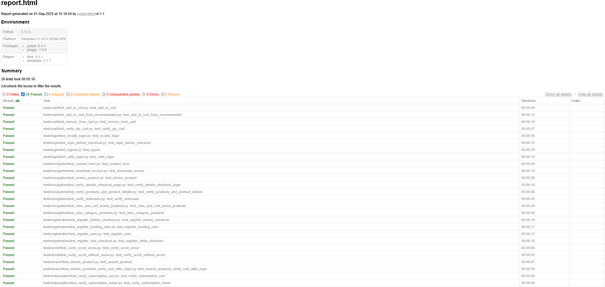

# Automation Exercise UI Test Suite

Automated functional UI tests for the [Automation Exercise](https://www.automationexercise.com/) web application, built using **Python**, **Selenium WebDriver**, and **PyTest**.  

This project follows the **Page Object Model (POM)** pattern to keep tests organized, maintainable, and scalable.

---

## Project Purpose

This project serves as both a **portfolio** and **practice project** for developing real-world UI automation skills.  
It is aligned with the **official [Automation Exercise test cases](https://www.automationexercise.com/test_cases)** to simulate professional testing workflows.

---

## Tech Stack

- Python 3.10+
- PyTest
- Selenium WebDriver
- Page Object Model (POM) pattern

---

## Getting Started

### Prerequisites
- Python 3.10+ installed
- `pip` package manager
- (Optional) Create and activate a virtual environment

### Installation
```bash
git clone https://github.com/rastkojovic/automationexercise-tests.git
cd automationexercise-tests
pip install -r requirements.txt
```

---

## Running Tests

Run all tests with:
```bash
pytest -v --tb=short
```

Run a specific category (e.g., search tests):
```bash
pytest tests/search
```

Generate an HTML report:
```bash
pytest --html=report.html --self-contained-html
```

---

## Project Structure

```
qa-automationexercise/
├── assets/                     
├── components/                 # Reusable UI components
│   ├── dialogue.py
│   └── navbar.py
├── flows/                      # High-level user flows (login, signup, etc.)
│   └── account_flow.py
├── pages/                      # Page Object Model (POM) classes
│   ├── base_page.py
│   ├── cart_page.py
│   ├── checkout_page.py
│   ├── contact_page.py
│   ├── delete_page.py
│   ├── home_page.py
│   ├── login_page.py
│   ├── payment_page.py
│   ├── product_details_page.py
│   ├── product_page.py
│   └── signup_page.py
├── tests/                      # Test suites grouped by feature
│   ├── cart/
│   ├── login/
│   ├── navigation/
│   ├── registration/
│   ├── scroll/
│   ├── search/
│   └── subscription/
├── conftest.py                 # Pytest configuration & fixtures
├── LICENSE                     # License file
└── README.md                   # Project documentation
```

---

## Test Cases

This project automates **26 UI test cases** based on the official  
[Automation Exercise test cases](https://www.automationexercise.com/test_cases).  

The tests are organized into categories:
- Cart  
- Login  
- Navigation  
- Registration  
- Scroll  
- Search  
- Subscription  

---

## Test Reports

After running tests, an **HTML report** is generated.  
A sample report and screenshot are included in this repository.



👉 [View Full Report (HTML)](report.html)

---

## License

This project is licensed under the **MIT License**.  
See the [LICENSE](LICENSE) file for details.